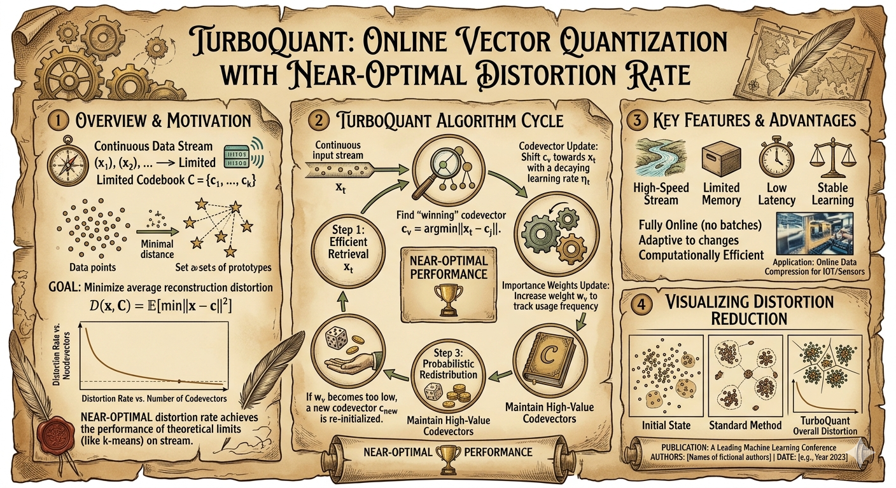

# Yet Another TurboQuant in PyTorch (YATQ)
## TurboQuant: KV Cache Quantization with Lloyd-Max and QJL

A PyTorch implementation of **TurboQuant** for KV cache compression, following the paper [TurboQuant: Online Vector Quantization with Near-optimal Distortion Rate](https://arxiv.org/abs/2504.19874) (ICLR 2026). With HuggingFace interface supported.

## Overview

This project implements the TurboQuant algorithm for compressing KV caches in Large Language Models. The implementation follows the paper exactly, including:

- **Lloyd-Max optimal scalar quantization** for the Beta/N(0, 1/d) distribution arising from random rotation
- **QJL (Quantized Johnson-Lindenstrauss)** for unbiased inner product estimation
- **Comprehensive evaluation** on real model KV caches (Qwen3-1.7B)
- Experiments shows although 1bit QJL can eliminate bias, it will increase variance and lead to top-k token shift. It is recommended not use 1bit QJL, just MSE. (maybe I'm wrong) 

## Paper References

- **TurboQuant**: [arXiv:2504.19874](https://arxiv.org/abs/2504.19874) - ICLR 2026
- **PolarQuant**: [arXiv:2502.02617](https://arxiv.org/abs/2502.02617) - AISTATS 2026
- **QJL**: [arXiv:2406.03482](https://arxiv.org/abs/2406.03482) - AAAI 2025

## Algorithm



### Stage 1: MSE-Optimal Quantization (TurboQuantMSE)

Based on **TurboQuant Algorithm 1** and **Section 3.1**:

```
1. Store vector norms separately: ||x||₂
2. Normalize to unit length: x̂ = x / ||x||₂
3. Apply random rotation: y = x̂ @ Π  (Π is orthogonal from QR decomposition)
4. After rotation, each coordinate follows N(0, 1/d)
5. Apply Lloyd-Max optimal scalar quantizer per coordinate
6. Dequantize and rescale: x̃ = dequantize(y) * ||x||₂
```

**Key Insight**: After random rotation of a d-dimensional unit vector, each coordinate follows a Beta distribution that converges to N(0, 1/d) for large d. This known distribution enables training-free optimal quantization.

### Stage 2: QJL for Unbiased Inner Products (TurboQuantProd)

Based on **TurboQuant Algorithm 2** and **Definition 1**:

```
1. MSE quantize: x_mse, idx = QuantMSE(x)  (uses bits-1 bits)
2. Compute residual: r = x - x_mse
3. QJL sketch: qjl = sign(S @ r)  (S ∈ R^{d×d}, uses 1 bit per element)
4. Store: (x_mse, qjl, ||r||₂)
```

**Inner Product Estimator** (Definition 1):
```
<y, x> ≈ <y, x_mse> + ||r|| * sqrt(π/2)/d * <S@y, sign(S@r)>
```

This estimator is **unbiased** with variance O(1/d).

## Installation

```bash
pip install torch numpy scipy
pip install transformers accelerate  # for HuggingFace models
```

## Usage

### Basic Usage

```python
from turboquant import TurboQuantMSE, TurboQuantProd
import torch

# Create quantizers (both use 3 bits total)
mse_quantizer = TurboQuantMSE(dim=128, bits=3, seed=28)    # 3 bits for MSE
prod_quantizer = TurboQuantProd(dim=128, bits=3, seed=28)  # 2 bits MSE + 1 bit QJL

# Quantize vectors
k = torch.randn(100, 128)
mse_recon, _, _ = mse_quantizer.quantize(k, return_indices=True)
prod_compressed = prod_quantizer.quantize(k)

# Compute inner products
query = torch.randn(10, 128)
mse_scores = torch.matmul(query, mse_recon.T)
prod_scores = prod_quantizer.inner_product(query, prod_compressed)

# Compare with true inner products
true_scores = torch.matmul(query, k.T)

def metrics(est, true):
    mse = torch.mean((est - true) ** 2).item()
    cos_sim = torch.cosine_similarity(est.flatten(), true.flatten(), dim=0).item()
    corr = torch.corrcoef(torch.stack([est.flatten(), true.flatten()]))[0, 1].item()
    return mse, cos_sim, corr

print("TurboQuantMSE (3-bit MSE):")
print(f"  MSE: {metrics(mse_scores, true_scores)[0]:.4f}, CosSim: {metrics(mse_scores, true_scores)[1]:.4f}, Corr: {metrics(mse_scores, true_scores)[2]:.4f}")

print("TurboQuantProd (2-bit MSE + 1-bit QJL):")
print(f"  MSE: {metrics(prod_scores, true_scores)[0]:.4f}, CosSim: {metrics(prod_scores, true_scores)[1]:.4f}, Corr: {metrics(prod_scores, true_scores)[2]:.4f}")
```

### KV Cache in Qwen3

```python
import torch
from transformers import AutoModelForCausalLM, AutoTokenizer
from integrations.qwen3_integration import Qwen3ForwardWithTurboQuant

MODEL_PATH = "Qwen/Qwen3-1.7B"
tokenizer = AutoTokenizer.from_pretrained(MODEL_PATH)
model = AutoModelForCausalLM.from_pretrained(MODEL_PATH, torch_dtype=torch.bfloat16, device_map="auto")

prompt = "Who are you?\nAnswer:"
inputs = tokenizer(prompt, return_tensors="pt").to(model.device)

# ========== FP16 Baseline ==========
print("=== FP16 Baseline ===")
with torch.no_grad():
    outputs_fp16 = model.generate(**inputs, max_new_tokens=50, temperature=0.7, top_p=0.5, use_cache=True, do_sample=False)
    print(tokenizer.decode(outputs_fp16[0], skip_special_tokens=True))

# ========== TurboQuant with QJL (Unbiased Inner Product) ==========
print("\n=== TurboQuant 4-bit with QJL ===")
tq_qjl = Qwen3ForwardWithTurboQuant(model, bits=4, use_qjl=True, keep_recent=24)

with torch.no_grad():
    outputs_qjl = tq_qjl.generate(inputs["input_ids"], max_new_tokens=50, temperature=0.7, top_p=0.5, do_sample=False)
    print(tokenizer.decode(outputs_qjl[0], skip_special_tokens=True))

stats = tq_qjl.get_compression_stats()
print(f"Compression ratio: {stats['ratio']:.2f}x")

# ========== TurboQuant MSE-only (Recommended for Quality) ==========
print("\n=== TurboQuant 4-bit MSE-only ===")
tq_mse = Qwen3ForwardWithTurboQuant(model, bits=4, use_qjl=False, keep_recent=24)

with torch.no_grad():
    outputs_mse = tq_mse.generate(inputs["input_ids"], max_new_tokens=50, temperature=0.7, top_p=0.5, do_sample=False)
    print(tokenizer.decode(outputs_mse[0], skip_special_tokens=True))
stats = tq_mse.get_compression_stats()
print(f"\nCompression ratio: {stats['ratio']:.2f}x")
```

**Output:**
```
=== FP16 Baseline ===
Who are you?
Answer: I am a large language model developed by Alibaba Group, and I am designed to assist users in various tasks, such as answering questions, providing information, and helping with different kinds of tasks. I am a language model that can understand and generate human-like

=== TurboQuant 4-bit with QJL ===
Who are you?
Answer: I am a large language model developed by Alibaba Group, and I am designed to assist users in various tasks, such as answering questions, providing information, and engaging in conversations. I am trained on a large amount of text, and I am a language

Compression ratio: 1.73x

=== TurboQuant 4-bit MSE-only ===
Who are you?
Answer: I am a large language model developed by Alibaba Group, and I am designed to assist users in various tasks, such as answering questions, providing information, and helping with different kinds of tasks.
But I am not a real person, and I cannot have

Compression ratio: 1.73x
```

## Implementation Details

### HuggingFace Integration

We provide two integration approaches:

#### 1. `TurboQuantHFWithCache` (MSE-only, Easy to Use)

Located in `integrations/hf_integration.py`. This implementation:
- Uses the model's **native forward pass** with `DynamicCache`
- Periodically compresses the KV cache using MSE quantization
- Keeps recent tokens in FP16 for quality
- **Pros**: Simple, works with any HuggingFace model, no forward pass modification
- **Cons**: No QJL support (MSE reconstruction only)

```python
from integrations.hf_integration import TurboQuantHFWithCache

model = AutoModelForCausalLM.from_pretrained(...)
tq_hf = TurboQuantHFWithCache(model, bits=4, keep_recent=32)
output = tq_hf.generate(input_ids, max_new_tokens=50)
```

#### 2. `Qwen3ForwardWithTurboQuant` (Full QJL Support)

Located in `integrations/qwen3_integration.py`. This implementation:
- Implements a **clean forward pass from scratch** following Qwen3's architecture
- Supports both **MSE-only** and **QJL unbiased inner product** modes
- Uses chunk-based storage: compressed chunks are stored once, never recompressed
- **Pros**: True QJL unbiased inner product estimation, better for research
- **Cons**: Only supports Qwen3 models, slower (no FlashAttention optimization)

```python
from integrations.qwen3_integration import Qwen3ForwardWithTurboQuant

model = AutoModelForCausalLM.from_pretrained(...)

# MSE-only mode (recommended for quality)
tq_mse = Qwen3ForwardWithTurboQuant(model, bits=4, use_qjl=False, keep_recent=32)

# QJL mode (unbiased inner product, use for research)
tq_qjl = Qwen3ForwardWithTurboQuant(model, bits=4, use_qjl=True, keep_recent=32)

output = tq_qjl.generate(input_ids, max_new_tokens=50)
```

### Lloyd-Max Algorithm

The Lloyd-Max algorithm finds optimal centroids minimizing MSE for a given distribution:

```python
def solve_lloyd_max(d, bits, max_iter=200, tol=1e-10):
    # PDF of N(0, 1/d)
    sigma = 1.0 / sqrt(d)

    # Initialize centroids uniformly
    centroids = linspace(-3.5*sigma, 3.5*sigma, n_levels)

    for _ in range(max_iter):
        # Step 1: Boundaries are midpoints between centroids
        boundaries = [(centroids[i] + centroids[i+1]) / 2 for i in range(n_levels-1)]

        # Step 2: Update centroids as E[X | X in partition]
        new_centroids = [integral(x * pdf(x), a, b) / integral(pdf(x), a, b) for each partition]

        if converged: break

    return centroids
```

### Bit Allocation

| Config | MSE bits | QJL bits | Total bits/elem | Additional Storage |
|--------|----------|----------|-----------------|-------------------|
| K:2b | 2 | 0 | 2 | vec_norm (16b/vector) |
| K:2b+QJL | 1 | 1 | 2 | vec_norm + residual_norm (32b/vector) |
| K:3b | 3 | 0 | 3 | vec_norm (16b/vector) |
| K:3b+QJL | 2 | 1 | 3 | vec_norm + residual_norm (32b/vector) |

### Keys vs Values Strategy

| Component | Method | Reason |
|-----------|--------|--------|
| **Keys** | MSE + QJL (optional) | Need inner products `<q, k>` for attention scores |
| **Values** | MSE only | Weighted sum `softmax(scores) @ V` averages out per-vector errors |

**Note**: The paper does not explicitly prescribe this distinction. It is a practical optimization based on how attention mechanisms use keys and values differently.

### QJL Inside Forward Pass

**Why QJL requires modifying the forward pass:**

Standard attention computes: `scores = Q @ K.T` where K is the reconstructed key cache.

With QJL, we need to compute the unbiased inner product estimator:
```
<q, k> ≈ <q, k_mse> + ||r|| * sqrt(π/2)/d * <S@q, sign(S@r)>
```

This requires:
1. Project the query through the same random matrix S: `q_proj = q @ S.T`
2. Compute inner product with stored QJL signs: `<q_proj, sign(S@r)>`
3. Apply the correction term with residual norm

**Implementation comparison:**

| Implementation | QJL Support | Description |
|----------------|-------------|-------------|
| `hf_integration.py` | ❌ No | Uses native model forward, MSE reconstruction only |
| `qwen3_integration.py` | ✅ Yes | Custom forward pass, supports QJL inner product |

The `qwen3_integration.py` stores full QJL data for compressed keys:
- `x_mse`: MSE reconstruction
- `qjl_signs`: sign(S @ residual)
- `residual_norm`: ||residual||₂

For raw (uncompressed) tokens, QJL correction is zero since they're exact.

**Performance note**: The current QJL implementation is slower than optimized attention (no FlashAttention). Community contributions for CUDA optimization are welcome. 


### Using QJL Unbiased Inner Product

QJL provides unbiased inner product estimation:

```
<y, x> ≈ <y, x_mse> + ||r|| * sqrt(π/2)/d * <S@y, sign(S@r)>
```

**Term 1** (`<y, x_mse>`): Standard inner product with MSE reconstruction
**Term 2** (QJL correction): Unbiased estimator eliminating quantization bias

```python
# Direct usage of compute_attention_qjl
tq_cache = TurboQuantKVCache(head_dim=128, bits=4)
tq_cache.append(keys, values)  # keys: (B, H, S, D)

query = torch.randn(1, 8, 128)  # (B, H, D)
output, weights = tq_cache.compute_attention_qjl(query)
# output: (B, H, D), weights: (B, H, S)
# Uses QJL: <query, keys> ≈ <query, k_mse> + qjl_correction
```

### WHT-based TurboQuant (Recommended for QJL)

For best results with QJL, use the WHT-based implementation matching llama.cpp:

```python
from turboquant_wht import TurboQuantWHT

# Create WHT-based quantizer
wht = TurboQuantWHT(dim=128, bits=3)

# Quantize keys with QJL
key_data = wht.quantize_key(keys, use_qjl=True)

# Compute attention scores
scores = wht.compute_attention_scores(query, key_data, use_qjl=True, scale=1/math.sqrt(128))
```

**WHT vs Random Rotation comparison (3-bit inner product MSE):**

| Method | MSE | QJL Effect |
|--------|-----|------------|
| Random rotation | 4.34 | QJL makes it 5.7x worse |
| **WHT** | 4.53 | **QJL makes it 1.8x better** |


## Experimental Results

### Test Setup
- **Model**: Qwen3-1.7B (28 layers, 8 KV heads, 128 head_dim)
- **Context Length**: 4124 tokens
- **Task**: Needle retrieval from long context

### Main Results Table (Top-K Accuracy)

| Config | MSE bits | QJL bits | Total | Ratio | CosSim | Top1% | Top5% | KL-Div | Bias% | Variance | RelErr |
|--------|----------|----------|-------|-------|--------|-------|-------|--------|-------|----------|--------|
| K:2b | 2 | 0 | 2 | 7.53x | 0.9975 | 65.2 | 87.9 | 6.59 | -9.90% | 320392 | 0.0890 |
| K:2b+QJL | 1 | 1 | 2 | 7.31x | 0.9910 | 52.2 | 77.7 | 10.12 | +1.67% | 383931 | 0.0874 |
| K:3b | 3 | 0 | 3 | 5.12x | 0.9992 | 69.2 | 94.2 | 5.71 | -2.96% | 48762 | 0.0333 |
| K:3b+QJL | 2 | 1 | 3 | 5.02x | 0.9967 | 61.6 | 82.1 | 8.15 | -0.06% | 61820 | 0.0350 |
| K:4b | 4 | 0 | 4 | 3.88x | 0.9998 | 81.7 | 99.6 | 2.87 | -0.44% | 7048 | 0.0119 |
| K:4b+QJL | 3 | 1 | 4 | 3.82x | 0.9990 | 68.8 | 93.8 | 6.01 | +0.39% | 29235 | 0.0241 |
| K:8b | 8 | 0 | 8 | 1.97x | 1.0000 | 96.0 | 99.6 | 0.05 | +0.00% | 153 | 0.0017 |
| K:8b+QJL | 7 | 1 | 8 | 1.95x | 1.0000 | 94.6 | 100.0 | 0.35 | -0.00% | 181 | 0.0019 |

### QJL Trade-off Analysis

| Total Bits | MSE-only Top1% | +QJL Top1% | Δ Top1 | MSE Bias% | MSE+QJL Bias% | Δ Variance |
|------------|----------------|------------|--------|-----------|---------------|------------|
| 2 | **65.2** | 52.2 | -12.9 | -9.90% | +1.67%        | +20% |
| 3 | **69.2** | 61.6 | -7.6 | -2.96% | -0.06%        | +27% |
| 4 | **81.7** | 68.8 | -12.9 | -0.44% | +0.39%        | +315% |
| 8 | **96.0** | 94.6 | -1.3 | +0.00% | -0.00%        | +18% |

### True Perplexity Measurement (KV Cache Compression)

Using `measure_true_ppl.py` with full forward pass through compressed KV cache:

**Test Setup:**
- **Model**: Qwen3-1.7B
- **Context Length**: 729 tokens
- **Compression**: 100% (keep_recent=0)
- **Metric**: Actual perplexity with compressed KV cache

**Results:**

| Bits | MSE PPL | QJL PPL | Winner | Compression Ratio |
|------|---------|---------|--------|-------------------|
| 2    | 251904  | **22016**   | QJL (10x better) | 8.0x |
| 3    | **1808**    | 4080    | MSE (2.3x better) | 5.33x |
| 4    | **472**     | 1320    | MSE (2.8x better) | 4.0x |
| 8    | 6.31    | 6.31    | Tie | 2.0x |

Baseline FP16 PPL: **6.22**

**Analysis:**

| Bits | QJL Effect | Reason |
|------|------------|--------|
| 2    | **Beneficial** (10x PPL reduction) | MSE reconstruction too crude → bias dominates → QJL's unbiased estimator helps |
| 3-4  | **Harmful** (2-3x worse PPL) | MSE reconstruction reasonable → variance dominates → QJL's variance hurts more |
| 8    | Neutral | Sufficient precision, both equivalent |

**Key Insight: Bias-Variance Trade-off**

QJL eliminates bias but increases variance. The effect depends on compression level:
- **Extreme compression (2-bit)**: MSE bias → 10% error → QJL helps by eliminating bias
- **Moderate compression (3-4 bit)**: MSE bias → 1-3% error → QJL's added variance hurts more

**Why differs from llama.cpp?**

llama.cpp reports `tbqp3_0` (QJL) better than `tbq3_0` (MSE) at 3-bit. Key differences:

| Implementation | Rotation Method | Sign Pattern | QJL Effect at 3-bit |
|----------------|-----------------|--------------|---------------------|
| YATQ (random rotation) | Random rotation (QR decomposition) | Random per seed | **Harmful** (MSE 24.75 vs 4.34) |
| YATQ (WHT) | Walsh-Hadamard Transform | Fixed deterministic | **Beneficial** (MSE 2.53 vs 4.53) |
| llama.cpp | Walsh-Hadamard Transform (WHT) | Fixed deterministic | Beneficial |

**Explanation:**

| Method | Inner Product MSE | QJL Effect |
|--------|-------------------|------------|
| Random 3b MSE | 4.34 | - |
| Random 3b QJL | 24.75 | 5.7x worse |
| WHT 3b MSE | 4.53 | - |
| **WHT 3b QJL** | **2.53** | **1.8x better** |

WHT has lower variance than random rotation:
- WHT is deterministic (same result every time)
- Random rotation is stochastic (different result each run)

This lower variance makes QJL's unbiased estimator beneficial with WHT, but harmful with random rotation.

**Recommendation**: Use WHT-based implementation (like llama.cpp) for best results with QJL.

## Key Findings

### 1. QJL Trade-off

**Theory**: QJL eliminates bias but increases variance.

**Observation (Top-K Accuracy)**: In attention scenarios:
- MSE's small bias is tolerated by softmax
- QJL's increased variance disrupts Top-1 ranking
- **MSE-only achieves better Top-K matching at the same bit budget**

**Observation (True PPL)**: QJL effect depends on compression level:
- **2-bit**: QJL is **beneficial** (10x PPL reduction) - bias dominates at extreme compression
- **3-4 bit**: QJL is **harmful** (2-3x worse PPL) - variance dominates at moderate compression
- **8-bit**: Both equivalent - sufficient precision

### 2. Bias-Variance Analysis

```
2-bit MSE: Bias = -9.90%, Variance = 320,392
2-bit QJL: Bias = +1.67%, Variance = 383,931 (+20%)

The 11.56% bias reduction comes at a 20% variance increase,
which hurts Top-1 matching by 12.9 percentage points.
```

### 3. KL Divergence Impact

Lower KL divergence = better attention distribution preservation:
- MSE-only consistently has lower KL divergence
- QJL's variance increases distribution shift

## Recommendations

| Use Case | Recommended Config | Reason |
|----------|-------------------|--------|
| Maximum compression (2-bit) | **2-bit MSE + QJL** | QJL reduces PPL by 10x at extreme compression |
| Balanced compression (3-4 bit) | **MSE-only** | QJL hurts PPL at moderate compression |
| High quality | 8-bit MSE | 2x ratio, ~96% Top-1, PPL ≈ FP16 |
| Unbiased estimation required | 2-3 bit + QJL | Bias ≈ 0%, but may increase PPL |

**Note**: Recommendations differ from llama.cpp due to different rotation methods (random vs WHT).

## File Structure

```
TurboQuant/
├── polarquant.py              # Lloyd-Max + Random Rotation quantization
├── qjl.py                     # QJL implementation
├── turboquant.py              # TurboQuantMSE and TurboQuantProd classes (random rotation)
├── turboquant_wht.py          # WHT-based TurboQuant matching llama.cpp
├── integrations/
│   ├── __init__.py
│   ├── hf_integration.py      # HuggingFace integration (MSE-only)
│   └── qwen3_integration.py   # Qwen3 forward with full QJL support
├── validate_qwen.py           # Validation script for Qwen3-1.7B (Top-K accuracy)
├── measure_true_ppl.py        # True perplexity measurement with compressed KV cache
├── measure_true_ppl_wht.py    # WHT-based PPL test
├── test_context_8k.txt        # Test context file
└── README.md
```

## Running Tests

```bash
# Test individual components
python polarquant.py
python qjl.py
python turboquant.py

# Validate on real model (Top-K accuracy)
python validate_qwen.py

# Measure true perplexity with compressed KV cache
python measure_true_ppl.py
```

## Discussions and Future Works

- ✅ **Qwen3 Integration**: Full QJL support is now available in `integrations/qwen3_integration.py`
- ✅ **HuggingFace Integration**: MSE-only compression available in `integrations/hf_integration.py`
- ✅ **True PPL Measurement**: `measure_true_ppl.py` confirms QJL is beneficial at 2-bit, harmful at 3-4 bit (random rotation)
- ✅ **WHT Implementation**: `turboquant_wht.py` implements Walsh-Hadamard Transform matching llama.cpp
- ✅ **WHT QJL Works**: WHT-based QJL is **beneficial** at 3-bit (MSE 2.53 vs 4.53), matching llama.cpp results
- 🔲 **WHT Integration**: Full Qwen3 forward pass with WHT for true PPL measurement
- 🔲 **CUDA Support**: Current implementation is PyTorch-only. CUDA kernels would significantly speed up compression
- 🔲 **BF16 Native Support**: Currently converts to float32 for quantization. Native BF16 would reduce overhead
- 🔲 **More Models**: Extend `qwen3_integration.py` approach to other model architectures (Llama, Mistral, etc.)

## Citation

```bibtex
@article{zandieh2025turboquant,
  title={TurboQuant: Online Vector Quantization with Near-optimal Distortion Rate},
  author={Zandieh, Amir and others},
  journal={arXiv preprint arXiv:2504.19874},
  year={2025}
}

@article{zandieh2025polarquant,
  title={PolarQuant: Quantizing KV Caches with Polar Transformation},
  author={Zandieh, Amir and others},
  journal={arXiv preprint arXiv:2502.02617},
  year={2025}
}

@article{zandieh2024qjl,
  title={QJL: 1-Bit Quantized JL Transform for KV Cache Quantization with Zero Overhead},
  author={Zandieh, Amir and others},
  journal={arXiv preprint arXiv:2406.03482},
  year={2024}
}
```

## License

This is a research implementation. Please refer to the original papers for licensing terms.